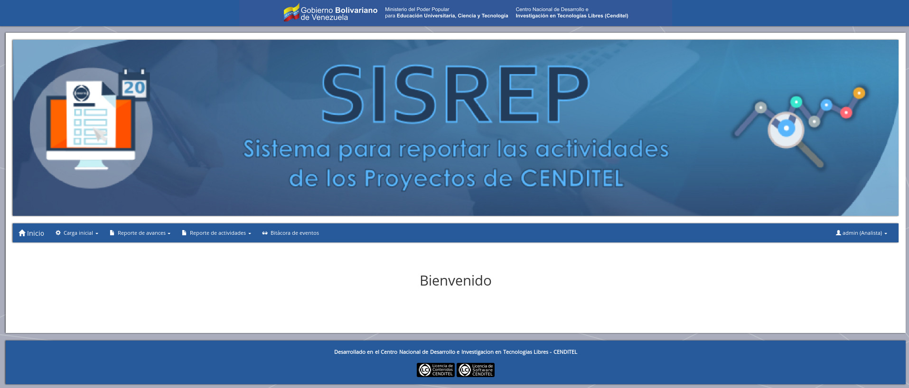

<h1>SISREP - Sistema para reportar las actividades de los Proyectos de CENDITEL</h1>

<b>Creado por el Ing. Argenis Osorio, Investigador de la Fundación CENDITEL</b>

<hr />

## Paquetes del Sistema Operativo requeridos
```
postgresql
libpq-dev
python-psycopg2
python-pip
```

## Paquetes de Python requeridos
```
Django==1.8.8
Python==2.7
postgres
psycopg2
```

<h2>Ejecutar los siguientes comandos en secuencia para desplegar el proyecto en un entorno de desarrollo</h2>

<b>Nota:</b>
<br />
Usaremos $ para describir los comandos que se usaran con usuario regular.

Usaremos # para describir los comandos que se usaran con superusuario. 

## Instalar los paquetes para crear entornos virtuales de Python
```
# apt-get install install python-setuptools python-dev

# apt-get install python-virtualenv virtualenvwrapper
```

## Crear un entorno virtual de Python
```
$ virtualenv mi_env

$ source mi_env/bin/activate
```

##  Instalar los requerimientos del Sistema Operativo y de Python
```
# apt-get install postgresql libpq-dev python-psycopg2

$ cd reporte_mensual_proyecto

$ pip install -r requirements.txt 
```

## Establecer el archivo de configuración principal del sistema
```
$ cd reporte_mensual_proyecto

$ cp settings.py_example settings.py

$ cd ..
```

## Crear un usuario y la base de datos del sistema desde la consola de postgresql
```
postgres=# CREATE USER mi_usuario PASSWORD 'mi_contrasena';

postgres=# CREATE DATABASE mi_base_de_datos OWNER mi_usuario;
```

## Ejecutar las migraciones y correr el servidor de desarrollo
```
$ bash reset_db.sh

$ python manage.py runserver
```

## Capturas

