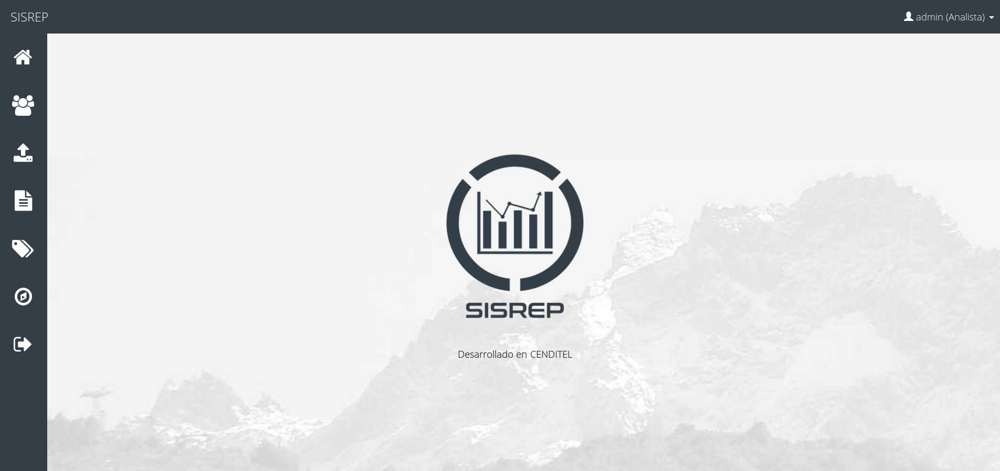

<h1>SISREP - Sistema de Reportes de Actividades de los Proyectos de CENDITEL</h1>

<b>Creado por el Ing. Argenis Osorio, Investigador de la Fundación CENDITEL</b>

<hr />

<h3>Paquetes del Sistema Operativo requeridos</h3>
```
postgresql
libpq-dev
python-psycopg2
```

<h3>Paquetes de Python requeridos</h3>
```
Django==1.8.8
Python==2.7
postgres
psycopg2
```

<h2>Ejecutar los siguientes comandos en secuencia para desplegar el proyecto en un entorno de desarrollo</h2>

<b>Nota:</b>
<br />
Usaremos $ para describir los comandos que se usaran con usuario regular.

Usaremos # para describir los comandos que se usaran con superusuario. 

<h3>Instalar los paquetes para crear entornos virtuales de Python</h3>
```
# apt-get install install python-setuptools python-dev

# apt-get install python-virtualenv virtualenvwrapper
```

<h3>Crear un entorno virtual de Python</h3>
```
$ virtualenv mi_env

$ source mi_env/bin/activate
```

<h3> Instalar los requerimientos del Sistema Operativo y de Python</h3>
```
# apt-get install postgresql libpq-dev python-psycopg2

$ cd reporte_mensual_proyecto

$ pip install -r requirements.txt 
```

<h3>Establecer el archivo de configuración principal del sistema</h3>
```
$ cd reporte_mensual_proyecto

$ cp settings.py_example settings.py

$ cd ..
```

<h3>Crear un usuario y la base de datos del sistema desde la consola de postgresql</h3>
```
postgres=# CREATE USER mi_usuario PASSWORD 'mi_contrasena';

postgres=# CREATE DATABASE mi_base_de_datos OWNER mi_usuario;
```

<h3>Ejecutar las migraciones y correr el servidor de desarrollo</h3>
```
$ bash reset_db.sh

$ python manage.py runserver
```

<h3>Capturas</h3>

